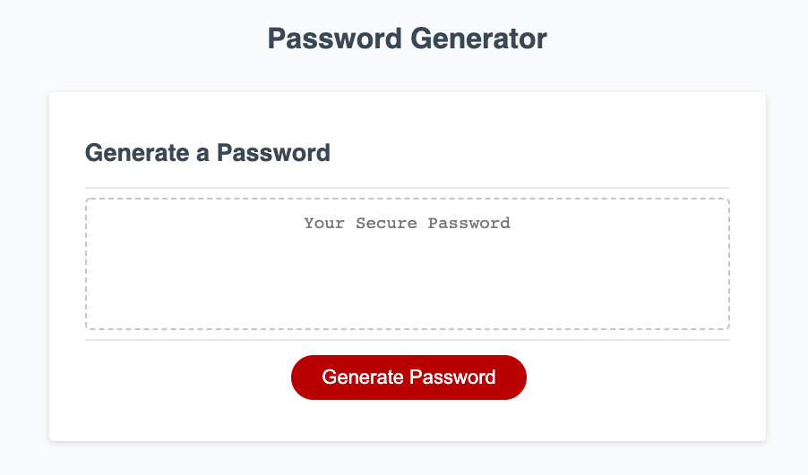
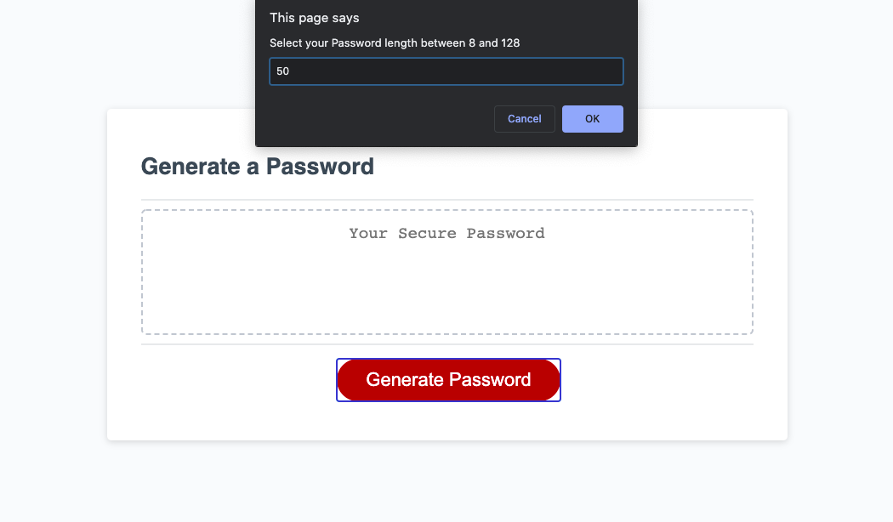
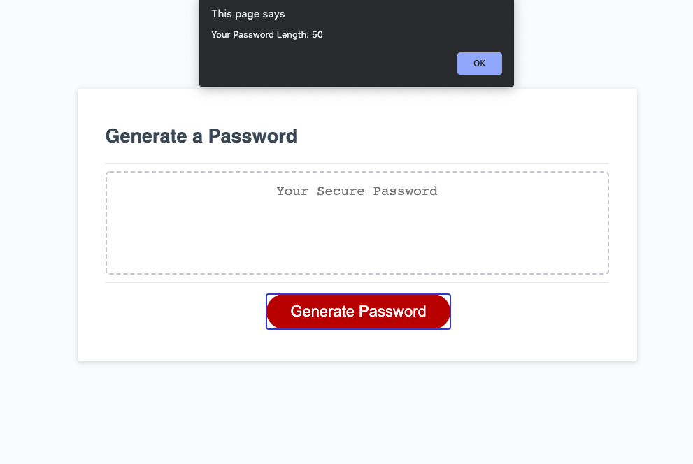
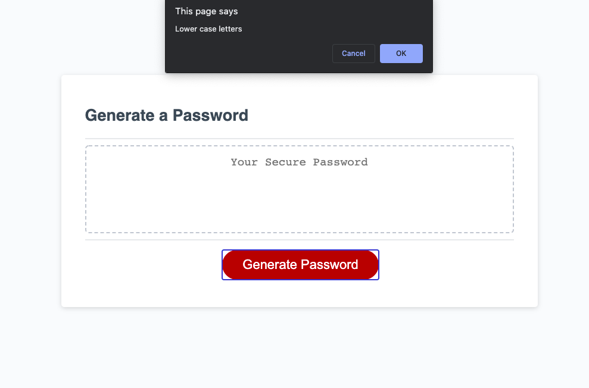
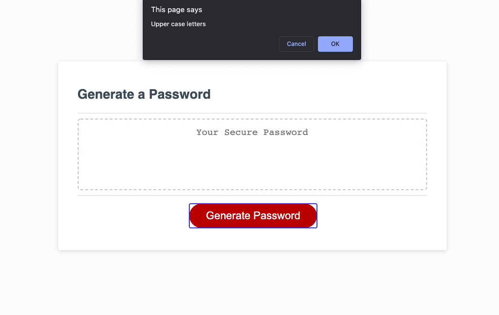
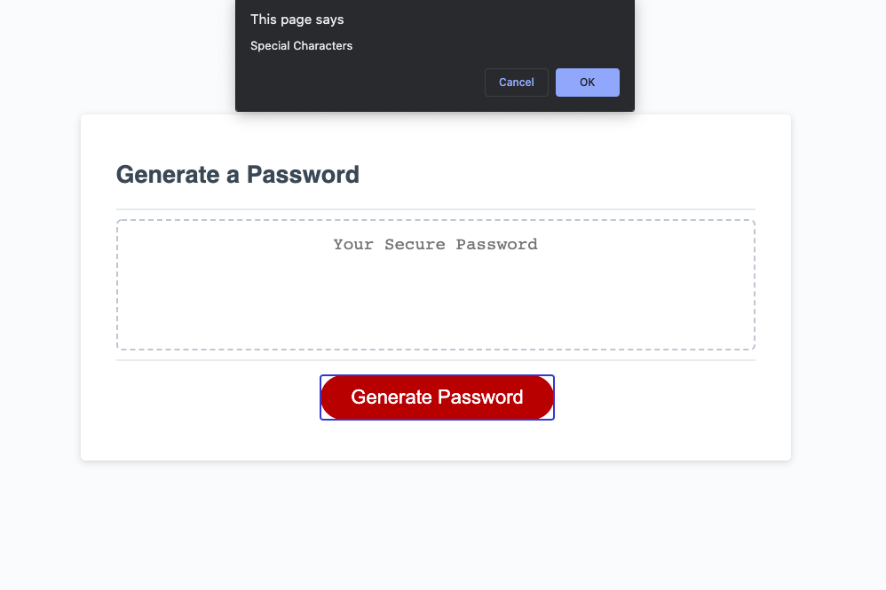
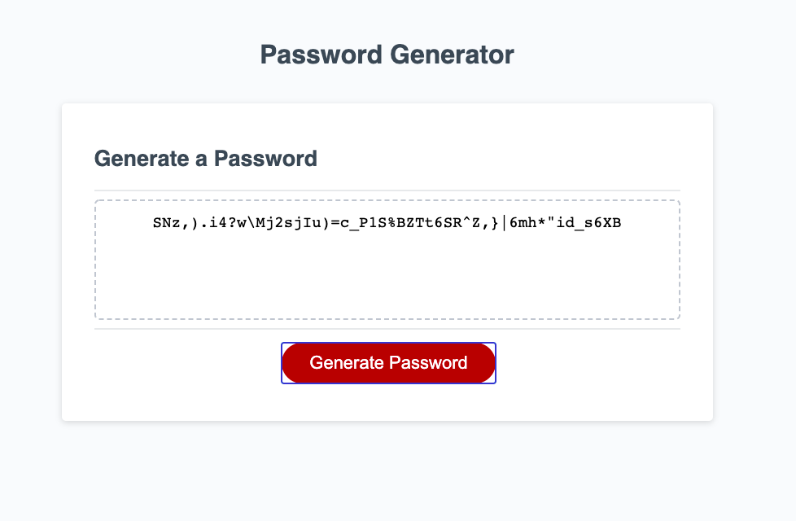

# Password-Generator
Modify starter code to create an application that enables employees to generate random passwords based on criteria that they’ve selected

# Finished Requirements
Click the button to generate a password\
Prompted for password criteria\
At least 8 characters and no more than 128 characters\
At least one character type\
Password is generated that matches the selected criteria\
Password is displayed in the box

# Instruction of Generator
[Index](./index.html)\
Start the Generator by clicking the button\
\
Type a number between 8 and 128\
\
\
Select password types\
\
\
\
\
Random password will be generated\

# Generator GitHub site
[Github Site](https://sg3606.github.io/Password-Generator/.)\